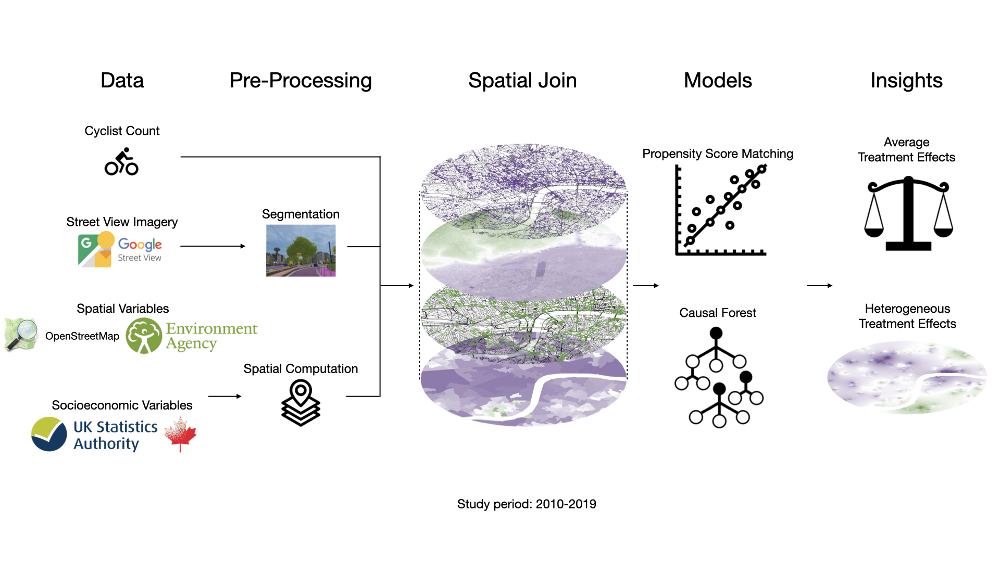
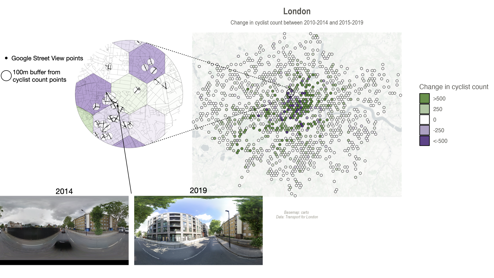
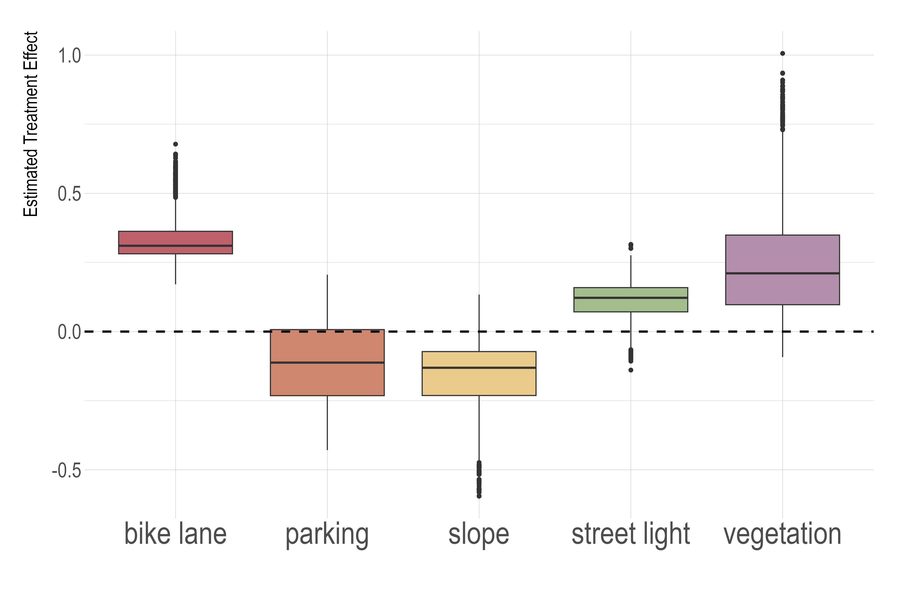
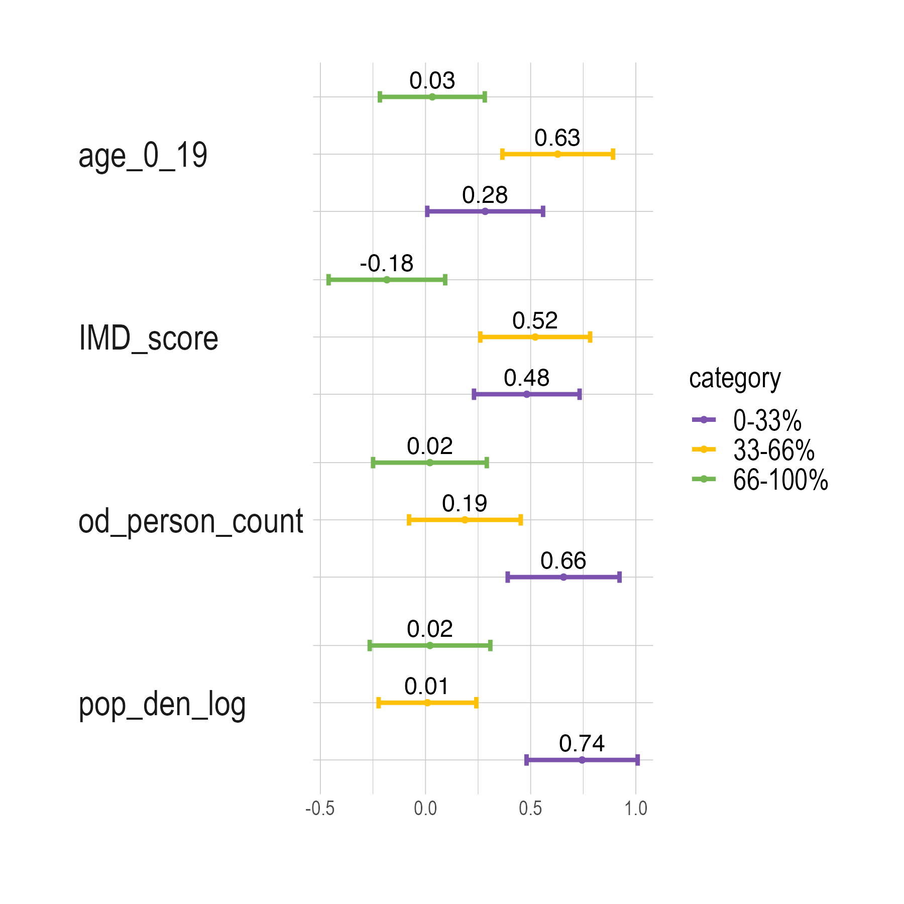

bike_SVI
==============================

# Examining the Causal Impacts of the Built Environment on Cycling Activities Using Time-Series Street View Imagery

*Overall workflow of the study*

This repository contains the code and data for the paper:

Ito, K., Bansal, P., & Biljecki, F. (2024). Examining the Causal Impacts of the Built Environment on Cycling Activities Using Time-Series Street View Imagery. Transportation Research Part A: Policy and Practice, 190, 104286. https://doi.org/10.1016/j.tra.2024.104286

## Abstract

Cycling is vital for sustainable and healthy cities. To encourage such activities, understanding urban bikeability at both detailed and broad spatial scales is crucial. Street view imagery (SVI) offers in-depth insights into how street features influence micro-mobility patterns, but existing studies are mainly correlational. This research utilized historical time-series SVI, cyclist data from London, to discern the causal effects of specific urban features on cyclist numbers. We used propensity score matching to adjust for potential confounding biases and applied the causal forest to estimate the heterogeneity in causal effects. 


*Map of changes in cyclist count in London and street view imgaery* 

## Summary of Findings

Our study revealed significant causal relationships between various urban design elements and cycling activities in London. Using propensity score matching (PSM) and causal forest models, we identified several key findings:

1. **Vegetation Impact**: We found that vegetation has a positive causal effect on cyclist counts. This effect is particularly pronounced in areas with moderate youth populations, lower levels of deprivation, fewer people detected in street view imagery, and lower population density. This suggests that greener areas not only attract younger cyclists but also that the benefits of such environments are maximized in less crowded, more spacious settings.

2. **Bike Lane Effectiveness**: Bike lanes showed a strong positive influence on cycling activities. Their effectiveness is notably higher on both high-speed and low-speed roads, as well as in densely populated areas. This highlights the importance of bike lanes in providing safety on high-risk roads and enhancing cycling infrastructure in urban cores where they can significantly alleviate transportation challenges.

3. **Slope Impact**: As expected, steeper slopes have a negative effect on cycling activities. This effect is more pronounced among older residents and in wealthier neighborhoods, indicating the need for targeted interventions in hilly areas to maintain cycling accessibility for all ages and socioeconomic groups.


*Box plots of estimated treatment effects for the five treatments*

1. **Heterogeneous Effects**: Our analysis revealed substantial variations in the impact of urban design interventions across different urban contexts. This heterogeneity underscores the importance of tailored approaches to urban planning and cycling infrastructure development.


*Estimated treatment effects of vegetation by covariate*

5. **Policy Implications**: The study's findings provide valuable insights for urban planners and policymakers. By identifying areas where specific interventions (such as increasing vegetation or adding bike lanes) can have the most significant impact, our research supports more targeted and effective strategies for promoting cycling in urban environments.

These results demonstrate the power of combining advanced causal inference techniques with rich urban data sources like street view imagery. By moving beyond correlational studies, our approach offers a more nuanced understanding of how urban design elements causally influence cycling behaviors, paving the way for more effective and data-driven urban planning strategies.

## Repository Structure

- `bike_svi/`: Source code for use in this project.
  - `data/`: Scripts to download or generate data
    - `clean_data/`: Scripts for cleaning and preprocessing data
    - `make_dataset.py`: Main script for data preparation
  - `features/`: Scripts to turn raw data into features for modeling
    - `build_features.py`: Script for feature engineering
  - `models/`: Scripts to train models and make predictions
  - `visualization/`: Scripts to create exploratory and results-oriented visualizations

- `notebooks/`: Jupyter notebooks for analysis
  - `bike_svi_analysis.ipynb`: Jupyter notebook containing the main data construction pipeline
  - `bike_svi_analysis.Rmd`: R Markdown file containing the main analysis pipeline

## Data Sources for London

| Data Type | Source |
|-----------|--------|
| Land Use | [London Datastore](https://data.london.gov.uk/dataset/land-use-ward?resource=1f9be3a5-7ea7-4996-8875-fa060d8335e4) |
| Population | [ONS](https://www.ons.gov.uk/peoplepopulationandcommunity/populationandmigration/populationestimates/datasets/censusoutputareaestimatesinthelondonregionofengland) |
| POI | [OpenStreetMap (OSM)](https://heigit.org/ohsome-py-python-package-for-osm-history-analytics-published/) |
| Terrain | [London DTM (10m)](https://environment.data.gov.uk/portalstg/home/item.html?id=be680dca782e4e6da467552d78676bd8) |
| Deprivation | [London Datastore](https://data.london.gov.uk/dataset/indices-of-deprivation) |
| Cyclist Count | [Department for Transport](https://roadtraffic.dft.gov.uk/regions/6) |

## Requirements

See `requirements.txt` for a list of required Python packages.

## Citation

If you use this code or data in your research, please cite our paper:

```bibtex
@article{ito_examining_2024,
  title = {Examining the Causal Impacts of the Built Environment on Cycling Activities Using Time-Series Street View Imagery},
  author = {Ito, Koichi and Bansal, Prateek and Biljecki, Filip},
  year = {2024},
  month = dec,
  journal = {Transportation Research Part A: Policy and Practice},
  volume = {190},
  pages = {104286},
  issn = {0965-8564},
  doi = {10.1016/j.tra.2024.104286}
}
```

--------

<p><small>Project based on the <a target="_blank" href="https://drivendata.github.io/cookiecutter-data-science/">cookiecutter data science project template</a>. #cookiecutterdatascience</small></p>
